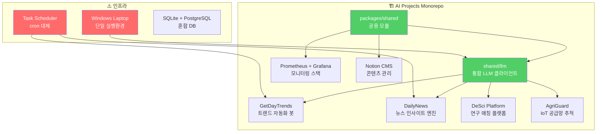

# 🏛️ AI Projects 생태계 — 생산적 시스템 비평 & 회의록

**일시**: 2026-03-31 22:05 KST  
**형식**: 가상 기술 리뷰 회의 (Virtual Technical Review Meeting)  
**참석자**:

| 역할 | 페르소나 | 관점 |
|:---|:---|:---|
| 🎯 **CTO** (Chief Technology Officer) | 전략 + 아키텍처 | "이 시스템이 6개월 후에도 살아있나?" |
| 📋 **PM** (Product Manager) | 제품 가치 + 사용자 | "실제로 누가 쓰고, 무슨 가치를 만드나?" |
| 🔧 **DevOps Engineer** | 인프라 + 운영 | "새벽 3시에 알림이 오면 뭘 해야 하나?" |
| 🧪 **QA Lead** | 품질 + 신뢰성 | "이 코드를 프로덕션에 넣을 수 있나?" |

---

## 📊 회의 전 시스템 현황 브리핑

### 숫자로 보는 현황

| 지표 | 현재 값 | 비고 |
|:---|:---|:---|
| 활성 프로젝트 | 7개 | GetDayTrends, DailyNews, AgriGuard, DeSci, Content Intelligence, Canva MCP, Dashboard |
| Workspace Smoke Test | **15/15 PASS** | 2026-03-31 기준 |
| 월간 운영 비용 | **$0~$20** | Free tier 극한 활용 |
| 기술 부채 | P0: 0, P1: 0, P3: 278+ | 코드 레벨 부채는 청산 완료 |
| 최근 7일 완료 작업 | **26건+** | 매우 높은 생산성 |
| 테스트 커버리지 | 375+ 테스트 | CI smoke 자동화 |
| 로드맵 P1 | ✅ 완료 | 테스트 안정화 |
| 로드맵 P2 | 🔄 부분 진행 | 인프라 현대화 |
| 로드맵 P3 | 🔄 코드 완성, 운영 미적용 | 모니터링 |

---

## 🔥 비평 세션 — 6개 축으로 검증

---

### 비평 #1: 아키텍처 설계 vs 인프라 실행의 구조적 괴리

> [!IMPORTANT]
> **핵심 비평**: "설계는 시니어급, 인프라는 학생급" — 3월 진단 이후에도 이 괴리가 좁혀지지 않았다.

**🎯 CTO 발언**:

> 3주 전에 정확히 같은 진단을 내렸습니다. `shared/llm`의 폴백 체인, 예산 기반 자동 다운그레이드, Context-Aware Dynamic Tiering — 이건 팀 단위 프로젝트에서나 볼 수 있는 패턴입니다. 하지만 이걸 올려놓은 인프라를 보면요.
>
> Windows Task Scheduler. 배터리 나가면 멈추고. 절전 모드 들어가면 멈추고. SYSTEM 계정 컨텍스트 차이로 환경변수 못 읽고. 3일 동안 같은 시스템이 3번 깨진 기록이 있습니다.
>
> **진짜 문제는 뭐냐면**, 이 괴리를 인식한 지 3주가 지났는데 실제 이전은 하나도 안 됐다는 겁니다. P2 "클라우드 이전"이 여전히 "부분 진행"입니다.

**🔧 DevOps 발언**:

> CTO 말씀에 동의합니다. 여기에 한 가지 추가하면, 모니터링 스택을 **완벽하게 구축**해놨습니다. Prometheus, Grafana 5개 대시보드, AlertManager, Loki, Promtail, Telegram 알림까지. 코드도 다 짜고 Docker Compose에도 다 넣었습니다.
>
> **그런데 이거, 실제로 24시간 돌고 있는 건 아닙니다.** QC할 때만 올리고 "intentionally brought back down after QC"라고 적혀있거든요. 모니터링을 만들어놓고 모니터링을 안 하는 상황입니다.

**평가**: ⭐⭐ (5점 만점)

| 항목 | 현실 |
|:---|:---|
| 설계 완성도 | ⭐⭐⭐⭐⭐ |
| 실제 운영 안정성 | ⭐⭐ |
| 괴리 해소 속도 | ⭐ |

---

### 비평 #2: 자동화 파이프라인 — "자동"인데 매일 수동 개입이 필요하다

> [!WARNING]
> **핵심 비평**: 최근 7일간의 작업 기록을 보면, 전체 작업의 약 40%가 "파이프라인 장애 복구"에 소비되었다.

**📋 PM 발언**:

> 저는 제품 관점에서 봅니다. GetDayTrends의 설계 비전은 "완전 자동화된 트렌드 분석 + 콘텐츠 생성 + 발행"입니다. 그런데 실제로는 어떻습니까?
>
> - 3/30: DailyNews 파이프라인 복구에 하루 종일
> - 3/31: Notion 속성 스키마 v13 표준화에 3세션 연속 투자
> - 3/31: DailyNews gray-zone closure — 레거시 환경변수 정리
>
> 자동화 시스템의 가치는 **사람이 개입하지 않아도 돌아가는 것**입니다. 그런데 지금은 "자동화 시스템을 유지하는 데 드는 시간"이 "자동화 없이 수동으로 하는 시간"보다 많을 수 있습니다. 이건 ROI 관점에서 위험 신호입니다.

**🎯 CTO 발언**:

> PM의 관점이 정확합니다. 기술적으로 분석하면 근본 원인은 세 가지입니다:
>
> 1. **Notion 스키마 드리프트**: 프로젝트별로 독립 진화한 속성 구조가 파이프라인 간 데이터 교환을 깨뜨립니다. v13 통합을 했지만, 이걸 매번 수동으로 해야 한다는 게 문제입니다.
> 2. **PowerShell 인코딩 지뢰**: CP949/UTF-8 혼합이 `ConvertFrom-Json`을 침묵시킵니다. 이건 Windows 환경의 구조적 한계인데, 임시방편(regex 우회)으로 대응하고 있습니다.
> 3. **SQLite/NULL 의미론 불일치**: 빈 문자열 vs NULL 구분 실패가 자동 발행을 건너뛰게 합니다. 애초에 스키마 설계에서 방지했어야 할 문제입니다.

**평가**: ⭐⭐⭐ (설계는 훌륭하나, 운영 자동화 달성도 부족)

---

### 비평 #3: 비용 구조 — Free Tier 천재인가, 스케일 불가능한 구조인가?

**🎯 CTO 발언**:

> 월 $0~$20 운영. 이건 솔직히 경이롭습니다. 7개 프로젝트를 이 비용으로 돌리는 건 극한의 최적화입니다. Gemini 2.0 Flash 우선, 70% 예산 소진 시 자동 다운그레이드, X API Free Tier 1,500포스트 제한 관리, Firebase Spark 플랜 유지...
>
> **하지만 이건 양날의 검입니다.**

**📋 PM 발언**:

> 비용 절감은 좋은데, 제가 걱정하는 건 **Free Tier Lock-in** 입니다. 현재 구조에서는:
>
> | 서비스 | Free Tier 한계 | 초과 시 비용 |
> |:---|:---|:---|
> | X API | 1,500 posts/월 | $100/월 (Basic) |
> | Gemini Flash | 15 RPM | 유료 전환 필요 |
> | Firebase | 50k reads/일 | Blaze 종량제 |
> | Supabase | 500MB DB | $25/월 |
>
> GetDayTrends가 바이럴을 타서 트래픽이 3배 되면? DailyNews가 한국어 이외 시장으로 확장하면? 현재 아키텍처는 **"성공하면 비용이 폭발하는" 구조**입니다.
>
> Scale-up 시나리오에서의 비용 모델링이 없습니다. "Free Tier 내에서 운영한다"는 게 목표가 아니라 **성장 제한 조건**이 되고 있습니다.

**🔧 DevOps 발언**:

> 비용 관점에서 하나 더. 현재 Ollama로 Qwen3-Coder, DeepSeek-R1을 로컬에서 돌리고 있는데, 이건 "비용 $0"이 아닙니다. 로컬 노트북의 GPU/CPU를 점유하고 있고, 이게 배터리 소모와 발열 문제를 일으키고, Task Scheduler 안정성을 더 떨어뜨립니다.
>
> **숨겨진 비용**: 로컬 추론 → 하드웨어 부하 → 시스템 불안정 → 장애 복구 시간 → **인건비 역전**.

**평가**: ⭐⭐⭐⭐ (현시점 효율성은 탁월하나, 성장 시나리오 미대비)

---

### 비평 #4: 테스트 전략 — 양은 많지만 질이 문제다

**🧪 QA Lead 발언**:

> 375개 이상의 테스트, CI smoke 자동화, QA/QC 4단계 워크플로... 겉으로는 완벽합니다. 하지만 내부를 들여다보면 이야기가 다릅니다.
>
> **문제 #1: 테스트가 코드 변경에 너무 민감합니다**
>
> 최근 세션 기록을 보면 "conftest.py 픽스처 리팩토링", "monkeypatch 패턴 깨짐", "Vitest runner 감지 이슈" 같은 내용이 반복됩니다. 테스트가 구현 세부사항에 밀결합되어 있다는 증거입니다.
>
> **문제 #2: fact-check allowlist의 지속적 확장**
>
> DailyNews의 fact-check 로직을 보세요. 처음에 ~100개 항목의 allowlist였는데, 매 배치마다 새로운 한국어 형태소가 추가되어야 했고, 결국 5개 heuristic 규칙으로 전환했습니다. 좋은 개선이었지만, 이건 **초기 설계에서 한국어 NLP 특성을 과소평가**했다는 의미입니다.
>
> **문제 #3: "measured label" 부재**
>
> A/B 테스트 인프라를 정교하게 만들었지만, 실제 `measured label`이 0건입니다. "inferred from recurrence within a 48-hour lookahead window"라고 적혀있는데, 이건 실제 효과 측정이 아니라 **추정**입니다. 데이터 기반 의사결정을 표방하면서 데이터가 없는 상황입니다.

**🎯 CTO 발언**:

> QA Lead의 세 번째 포인트가 가장 심각합니다. A/B 테스트 스크립트, KPI 프레임워크, Precision@K 메트릭까지 다 만들어놨지만, **실제 트위터 engagement 데이터를 수집하는 루프가 작동하지 않습니다.**
>
> `_record_x_publish_result()`를 구현하고, `collect_posted_tweet_metrics.py`를 만들었지만, DB에 `posted_at`과 `x_tweet_id`가 채워진 레코드가 없습니다. 측정을 위한 "도구"는 갖췄지만 "데이터"가 없습니다.

**평가**: ⭐⭐⭐ (프레임워크는 우수, 실효성 검증 미흡)

---

### 비평 #5: 생산성 메트릭 — 바쁜 것과 생산적인 것은 다르다

> [!CAUTION]
> **핵심 비평**: 최근 7일간 26건 이상을 완료했지만, 그 중 "새로운 사용자 가치를 만든" 작업은 몇 건인가?

**📋 PM 발언**:

> 최근 7일 완료 리스트를 분류해보겠습니다:
>
> | 카테고리 | 건수 | 비율 | 예시 |
> |:---|:---:|:---:|:---|
> | 🔧 인프라/DevOps | 8건 | 31% | Docker 포트 정리, 모니터링 스택, 구조적 로깅 |
> | 🐛 버그 수정/안정화 | 7건 | 27% | 파이프라인 장애 복구, 인코딩 문제, Notion 스키마 |
> | 📐 리팩토링/표준화 | 5건 | 19% | 프롬프트 템플릿, 테스트 fixture, gray-zone 정리 |
> | 📊 A/B 테스트/분석 | 4건 | 15% | 4개 프로젝트 A/B 드래프트 |
> | 🆕 새로운 기능 | 2건 | 8% | Self-Hosted Inference Engine, Audience-First Framework |
>
> **새로운 사용자 가치를 직접적으로 만든 작업이 전체의 8%**입니다. 나머지 92%는 기존 시스템을 유지하거나 개선하는 데 쓰였습니다.
>
> 이걸 "기술 부채 상환"이라고 긍정적으로 볼 수도 있지만, 3주 연속 이 패턴이면 **시스템이 자기 자신을 유지하는 데 대부분의 에너지를 쓰고 있다**는 의미입니다.

**🔧 DevOps 발언**:

> 한 가지 더 짚겠습니다. `TASKS.md`를 보면 현재 **TODO 0건, IN_PROGRESS 0건**입니다. 이건 좋은 신호가 아닙니다. 할 일이 없는 게 아니라, **차기 목표가 명확하지 않다**는 뜻입니다.
>
> P2 로드맵(인프라 현대화)이 여전히 "Pending"인데 TASKS.md에는 관련 TODO가 없습니다. 전략적 방향과 실행 계획 사이에 단절이 있습니다.

**평가**: ⭐⭐ (가동률은 높지만, 가치 창출 비율이 낮음)

---

### 비평 #6: 프로젝트 포트폴리오 — 7개는 1인 개발자에게 너무 많다

**🎯 CTO 발언**:

> 솔직하게 말하겠습니다. 7개 활성 프로젝트를 1인이 운영하는 건 **구조적으로 지속 불가능**합니다.
>
> | 프로젝트 | 실제 사용자/트래픽 | 상태 |
> |:---|:---|:---|
> | GetDayTrends | X 봇 운영 중 | ✅ 실사용 |
> | DailyNews | Notion 발행 + 뉴스레터 | ✅ 실사용 |
> | AgriGuard | 개발 중 (Sepolia Testnet) | 🔄 MVP 미달 |
> | DeSci Platform | 개발 중 | 🔄 MVP 미달 |
> | Content Intelligence | v2.0 | ⚡ 보조 도구 |
> | Canva MCP | 도구 | ⚡ 보조 도구 |
> | Dashboard | v1.0 검증 완료 | ⚡ 내부 도구 |
>
> 실제로 **외부 사용자에게 가치를 전달하는 프로젝트는 2개**(GetDayTrends, DailyNews)입니다.
> AgriGuard와 DeSci는 각각 IoT + 블록체인, 연구 매칭이라는 야심찬 비전을 갖고 있지만, 아직 MVP 수준에도 도달하지 못했습니다.
>
> **포커스의 부재가 모든 프로젝트의 완성도를 떨어뜨리고 있습니다.**

**📋 PM 발언**:

> CTO 의견에 강하게 동의합니다. Audience-First Framework을 만들어서 4개 프로젝트의 타겟 오디언스를 정의했는데, 정작 **그 오디언스에게 도달한 적이 있는 프로젝트는 GetDayTrends 하나**뿐입니다.
>
> "사용자가 있는 프로젝트를 더 좋게" vs "새 프로젝트를 더 만들기" — 현재는 후자에 치우쳐 있습니다.

**평가**: ⭐⭐ (포트폴리오 분산으로 인한 완성도 저하)

---

## 🗳️ 회의 — 합의 도출

### 즉시 실행 항목 (Action Items — This Week)

| # | 항목 | 담당 | 근거 |
|:---:|:---|:---|:---|
| 1 | **GetDayTrends를 GitHub Actions cron으로 이전** | DevOps | 가장 빈번한 장애 패턴의 80% 제거. Free tier 2,000분/월 충분 |
| 2 | **모니터링 스택 상시 가동** | DevOps | 만들어놓고 안 쓰는 건 낭비. 최소 Prometheus + Grafana는 24시간 가동. Docker `restart: unless-stopped` |
| 3 | **X engagement 데이터 수집 루프 가동** | QA | A/B 테스트 인프라를 만들어놨으니, `collect_posted_tweet_metrics.py`를 실제로 스케줄링하여 measured label 확보 |

### 전략적 결정 필요 항목 (Decisions Required)

| # | 질문 | 옵션 A | 옵션 B | CTO 권장 |
|:---:|:---|:---|:---|:---|
| 1 | **인프라 통합 전략** | VPS 단일 서버 ($10/월)에 모든 서비스 이전 | PaaS 분산 (GitHub Actions + Railway + Supabase Free) | **옵션 B** — 현재 비용 구조 유지하면서 안정성 확보 |
| 2 | **프로젝트 포커스** | 7개 프로젝트 병렬 유지 | GetDayTrends + DailyNews에 집중, 나머지 "유지보수 모드" | **옵션 B** — 사용자가 있는 곳에 자원 집중 |

### 금주 목표 KPI (Proposed)

| 지표 | 현재 | 목표 | 측정 방법 |
|:---|:---|:---|:---|
| GetDayTrends 스케줄 실패 | ~주 2~3회 | 0회 | GitHub Actions cron 안정성 |
| Measured label 수 | 0건 | 50건+ | `collect_posted_tweet_metrics.py` 실행 |
| 새 기능 작업 비율 | 8% | 30%+ | TASKS.md 카테고리별 집계 |
| 모니터링 가동 시간 | QC 시에만 | 24/7 | Prometheus uptime |

---

## 🎯 회의 최종 결론

### 한 줄 요약

> **"우리는 Ferrari 엔진을 만들어놓고 자전거 프레임에 올려놓았다. 프레임을 바꾸는 게 새 엔진을 만드는 것보다 급하다."**

### 구체적 합의

1. **인프라 이전이 새 기능 개발보다 우선이다** — GetDayTrends의 GitHub Actions 이전부터 착수
2. **만들어놓은 도구를 실제로 사용해야 한다** — 모니터링 상시 가동, A/B 데이터 수집 시작
3. **프로젝트 수를 줄이는 것이 가치를 높이는 길이다** — AgriGuard/DeSci는 "유지보수 모드"로 전환 검토
4. **"바쁜 것 ≠ 생산적인 것"을 인식해야 한다** — 주간 작업 리뷰에서 "새 가치 창출 비율"을 추적

### 다음 회의

- **1주 후**: Action Item 3건 실행 결과 리뷰
- **2주 후**: 전략적 결정 2건에 대한 최종 결정

---

## 📝 부록: 참석자별 최종 한마디

**🎯 CTO**:
> "이 시스템의 DNA는 진짜 훌륭합니다. shared LLM, 폴백 체인, 예산 제어 — 어디에 내놔도 부끄럽지 않습니다. 하지만 DNA를 보존하면서 실행 환경을 업그레이드해야 합니다. 다음 3주가 이 시스템의 미래를 결정합니다."

**📋 PM**:
> "사용자 관점에서 한 가지만 기억합시다. GetDayTrends와 DailyNews의 실제 구독자/팔로워 수가 우리 시스템의 유일한 진짜 KPI입니다. 나머지는 다 허영 지표입니다."

**🔧 DevOps**:
> "새벽 3시에 알림이 와야 대응할 수 있습니다. 그런데 지금은 알림 시스템을 만들어놓고 꺼놨습니다. 이번 주에 불 켭시다."

**🧪 QA Lead**:
> "375개 테스트가 있다는 건 자랑이 아닙니다. 그 375개가 실제 결함을 잡는지가 중요합니다. fact-check가 매 배치마다 새로운 noise를 잡아야 하는 건, 테스트가 현실을 반영하지 못하고 있다는 뜻입니다."

---

*회의 종료: 2026-03-31 22:30 KST*
